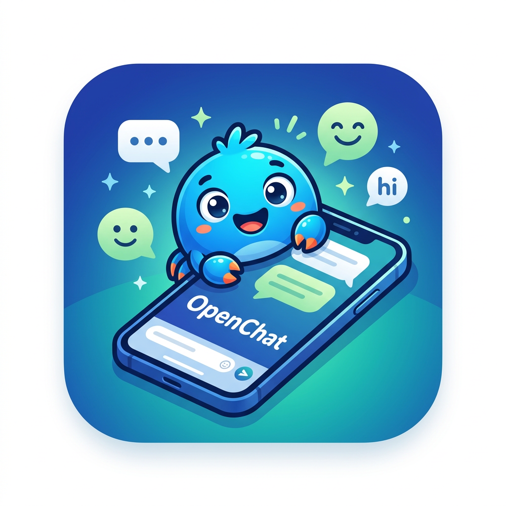

<div align="center">



# Open-Chat

**A private, Signal-style chat interface for autonomous agents**
(OpenClaw · Hermes · Draymond Orchestrator · SubTeam · Uplift Bridge · ntfy)

Open-Chat is a clean, local-first messaging app designed to replace Telegram/Slack/Discord as the control surface for autonomous agents. Chat directly with your AI agents through a beautiful, responsive interface — no third-party platforms required.


[](https://github.com/ncsound919/Open-Chat/actions/workflows/ci.yml)
[](https://github.com/ncsound919/Open-Chat/actions)


</div>

## 📦 Releases

Pre-built Android APKs are published on the
**[GitHub Releases page](https://github.com/ncsound919/Open-Chat/releases)**.

- Download the latest `.apk`, enable **Install unknown apps** for your file manager,
  and sideload it onto your Android device.
- Each release includes the app icon, the compiled web bundle (React 19 / Vite 8),
  and the Capacitor native shell.
- See **Setup** and **Testing** sections below for agent configuration and how to
  verify the app.

## Why Open Chat?

**Third-party messaging platforms are fundamentally insecure for AI agent communication.** Telegram, Slack, Discord, and WhatsApp introduce critical vulnerabilities:

- 🔓 **Token Exposure** — Bot credentials leak through GitHub, logs, and infrastructure breaches
- 🕵️ **No E2E Encryption** — Platform employees and attackers can read all your conversations
- 🎯 **C2 Attack Vector** — Your bot shares infrastructure with active malware operations
- ⛔ **Rate Limits & Bans** — Arbitrary account suspensions and message throttling
- 📊 **Data Retention** — Your messages stored indefinitely on third-party servers
- 🌐 **Platform Dependency** — Outages, API changes, and vendor lock-in

**Open Chat's local-first architecture removes the third-party platform layer** — connecting directly to `127.0.0.1` means no platform server ever sees your messages or credentials. The current build ships with input sanitization, connection timeouts, host validation warnings, token masking, and an Error Boundary for graceful recovery.

> ⚠️ **Threat model note:** Full security requires running with the default localhost-only configuration. Bot tokens stored in Settings are currently saved as plaintext in `localStorage` — avoid high-value tokens until token encryption is added in a future release.

👉 **[Read the full security analysis and implementation status](./SECURITY.md)**

## Features

### ✨ Current (MVP)
- **Multi-Agent Support**: Chat with OpenClaw (WebSocket), Hermes (HTTP), Uplift Bridge, SubTeam, and Draymond Orchestrator agents
- **Real-Time Streaming**: See AI responses as they're generated, token by token
- **Markdown Rendering**: Code blocks, lists, bold, italic, inline code — all beautifully formatted
- **Local-First**: All data stored in your browser — zero telemetry, 100% private
- **Message Management**: Right-click context menu for copy/delete
- **Bot Configuration**: Easy setup and management of multiple agents
- **Smart Auto-Scroll**: Follows conversation without disrupting reading
- **Connection Status**: Real-time indicators for each agent
- **Auto-Reconnect**: WebSocket connections automatically recover
- **Responsive Design**: Works perfectly on desktop and mobile browsers
- **5 Protocol Support**: OpenClaw, Hermes, Uplift Bridge, SubTeam, Draymond Orchestrator
- **Orchestrator Integration**: Deep integration with Draymond for multi-agent coordination, workflow tracking, and agent discovery

## Quick Start

### Prerequisites
- **Node.js** 20.19+ (required by Vite 8) and npm
- **One or more agents**: OpenClaw, Hermes, Uplift Agent, SubTeam, or Draymond Orchestrator
- **Android** (optional): Android Studio SDK + JDK 21 for APK builds

### Installation

```bash
# Clone the repository
git clone https://github.com/ncsound919/Open-Chat.git
cd Open-Chat

# Install dependencies
npm install

# Start development server
npm run dev

# Open http://localhost:5173 in your browser
```

### Building for Production

```bash
# Build optimized bundle
npm run build

# Preview production build
npm run preview
```

### Android App (Capacitor)

Open-Chat ships as an Android app built with Capacitor. Pre-built APKs are published
to the [GitHub Releases](https://github.com/ncsound919/Open-Chat/releases) page —
download the `.apk`, enable "Install unknown apps" for your file manager, and sideload it.

To build the APK yourself:

```bash
# 1. Build the web bundle and sync it into the Android project
npm run android:build

# 2. Compile the APK (JDK 21 + Android SDK required)
cd android
./gradlew assembleDebug

# 3. The signed debug APK is at:
#    android/app/build/outputs/apk/debug/app-debug.apk
```

Notes:
- The app icon is generated from `public/logo.png` via `scripts/gen_icons.py`.
- App icons live in `android/app/src/main/res/mipmap-*/ic_launcher*.png`.
- Native-only features (StatusBar, Keyboard, haptics, local notifications) are guarded
  by `src/utils/platform.js` and degrade gracefully on web/Electron.

### Desktop App (Electron)

```bash
npm run electron:dev       # Build + launch the desktop app
npm run electron:build     # Package installers for Windows/macOS/Linux
```

Electron runs sandboxed with `contextIsolation` enabled, `nodeIntegration` off, and a
strict Content-Security-Policy injected on every response.

## Configuration

### OpenClaw Setup

1. Start OpenClaw with gateway enabled: `openclaw --gateway`
2. In Open-Chat, configure your bot:
   - **Protocol**: OpenClaw (WebSocket)
   - **Host**: `127.0.0.1` / **Port**: `18789`
   - **Token**: Set `OPENCLAW_GATEWAY_TOKEN` (optional)

### Hermes Setup

1. Start Hermes agent with API server: `hermes --api-server`
2. Configure CORS in Hermes `.env`: `API_SERVER_CORS_ORIGINS=*`
3. In Open-Chat, configure your bot:
   - **Protocol**: Hermes (HTTP)
   - **Host**: `127.0.0.1` / **Port**: `8642`
   - **Token**: Your `API_SERVER_KEY` (if set)

### Uplift Bridge Setup

1. Start Uplift in remote control mode: `uplift remote-control`
2. Complete OAuth authentication to get your access token
3. In Open-Chat, configure your bot:
   - **Protocol**: Uplift Bridge (Uplift Agent)
   - **Host**: Your bridge endpoint host
   - **Port**: Your bridge endpoint port
   - **Token**: Your OAuth access token

### SubTeam / Draymond Setup

1. Set up a SubTeam HTTP wrapper (see [AGENT_INTEGRATION.md](./AGENT_INTEGRATION.md))
2. Start your wrapper server
3. In Open-Chat, configure your bot:
   - **Protocol**: SubTeam (CPU Design / Draymond)
   - **Host**: `127.0.0.1`
   - **Port**: Your wrapper port (e.g., `8643`)
   - **Token**: Optional auth token

### Draymond Orchestrator Setup

1. Start Draymond Orchestrator with all agents registered
2. Ensure the orchestrator API is running (default port: `8644`)
3. In Open-Chat, configure your bot:
   - **Protocol**: Draymond Orchestrator (Multi-Agent)
   - **Host**: `127.0.0.1`
   - **Port**: `8644`
   - **Token**: Your orchestrator API key (if required)

This enables deep integration features:
- **Agent Discovery**: Automatically discover available agents and their capabilities
- **Multi-Agent Coordination**: Submit tasks that coordinate across multiple specialized agents
- **Workflow Tracking**: Monitor multi-phase workflows with real-time status updates
- **Tool Execution Monitoring**: Track which agents are executing which tools
- **Event Stream**: Real-time SSE updates for all orchestrator activities

📘 **For detailed setup instructions**, see [AGENT_INTEGRATION.md](./AGENT_INTEGRATION.md)

## Usage

### Managing Bots
- **Add Bot**: Click `+` button in Inbox
- **Edit Bot**: Click ⚙️ icon next to any bot
- **Delete Bot**: Open Settings → Delete

### Chatting
- **Send Message**: Type and press Enter (Shift+Enter for new line)
- **Copy Message**: Right-click message → Copy text
- **Delete Message**: Right-click message → Delete
- **Clear Chat**: Click menu (⋮) in chat header → Clear Chat

## Roadmap

See [IMPLEMENTATION_PLAN.md](./IMPLEMENTATION_PLAN.md) for details.

### Phase 1 (Current - MVP) ✅
- ✅ Multi-agent support (OpenClaw + Hermes)
- ✅ Real-time streaming & markdown rendering
- ✅ Message context menu & bot management
- ✅ Auto-reconnect & smart auto-scroll

### Phase 2+ (Future)
- Multi-channel support & agent tagging
- Enhanced search & IndexedDB storage
- Tool execution console & developer mode
- Team features & automation engine

## Testing

Open-Chat ships with a comprehensive Vitest + React Testing Library suite
(695 tests across 33 files) covering components, hooks, protocol clients, and
utilities. For the full manual test checklist and common issues, see
**[TESTING.md](./TESTING.md)**.

```bash
npm run lint       # ESLint (zero warnings allowed)
npm test           # Run the full test suite
npx vitest --coverage   # Run with coverage (thresholds enforced)
```

Coverage thresholds (enforced by `vitest run --coverage`):

| Metric     | Threshold |
|------------|-----------|
| Lines      | 98%       |
| Statements | 96%       |
| Functions  | 92%       |
| Branches   | 90%       |

### What's tested

- **Protocol clients** — OpenClaw (WebSocket), Hermes, Ntfy, Draymond Orchestrator,
  SubTeam, and Uplift Bridge: connect/send/reconnect, offline queueing, action
  execution, and error paths.
- **Components** — Chat, Inbox, Settings, MessageBubble, AuditLog, DeveloperPanel,
  ToolExecutionConsole, OnDeviceInsights, ErrorBoundary, and icons.
- **Hooks & utils** — auto-resize, scroll-follow, voice, storage (quota/pruning),
  security (sanitization/token masking), markdown, and notifications.
- **Android-native edge cases** — black-screen GPU compositing regressions,
  `window.Capacitor` guards, and Capacitor plugin availability.

### Manual test checklist

1. **Chat streaming** — send a message to a Hermes bot and confirm token-by-token
   streaming, then interrupt mid-stream (works for all protocols except OpenClaw).
2. **Inbound mid-stream safety** — trigger an inbound ntfy/Draymond notification
   while a reply is streaming; the stream must keep writing to its own message.
3. **Protocol switch** — edit a bot from OpenClaw → Draymond and confirm the old
   socket closes and the new client connects.
4. **On-device insights** — open a Draymond message and confirm the panel completes
   instead of hanging on "Thinking on-device…"; retry after a failed generation.
5. **Remote management** — in Draymond bot Settings, confirm chains and schedules
   load and that toggling a schedule sends `enable`/`disable`.

## Development

```bash
npm run dev      # Start dev server (localhost:5173)
npm run build    # Build for production
npm run preview  # Preview production build
```

## Contributing

Contributions are welcome! See **[CONTRIBUTING.md](./CONTRIBUTING.md)** for
guidelines, and our **[Code of Conduct](./CODE_OF_CONDUCT.md)**.

## License

MIT License - see [LICENSE](./LICENSE) file

## Credits

Created by [@ncsound919](https://github.com/ncsound919) | Built for the agent-native future 🤖
